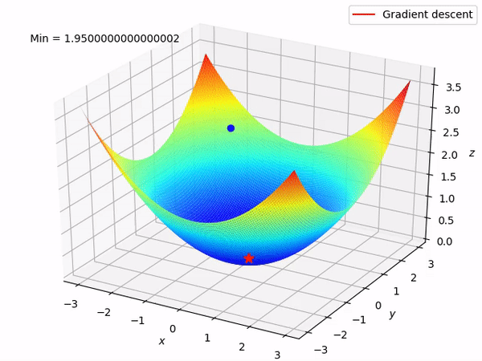

# Optimizer_implementation

The goal of this repository is the implementation in Pytorch of the main optimizers existing (Adam, SGD, Adagrad, Adadelta, RMSProp) algorithms

## Build Status

The project is over and all main algorithms have were built.

Throughout the project, if you see any improvements that could be made in the code, do not hesitate to reach out at
Hippolyte.guigon@hec.edu. I will be delighted to get some insights !

## Code style

The all project was coded under PEP-8 (https://peps.python.org/pep-0008/) and flake8 (https://pypi.org/project/flake8/) compliancy. Such compliance is verified during commits with pre-commits file ```.pre-commit-config.yaml```

## Installation

* This project uses a specific conda environment, to get it, run the following command: ```conda env create -f optimizer_implementation.yml```

* To install all necessary libraries, run the following code: ```pip install -r requirements.txt```

* This project has its own package that is used. To get it, run the following command: ```python install setup.py```

## Screenshot



Gradient descent optimization performed on a convex function

## How to use ?

To use the optimizer you want with the MNIST dataset, write the following step by step: 

* ```from optimizer_implementation.optim.optimizer import your_chosen_optimizer```
* ```from optimizer_implementation.utils.utils import launch_training```
* ```launch_training(optimizer=chosen_optimizer)```
